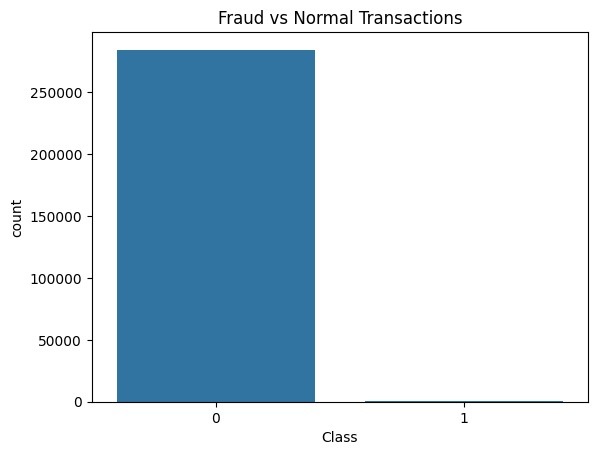
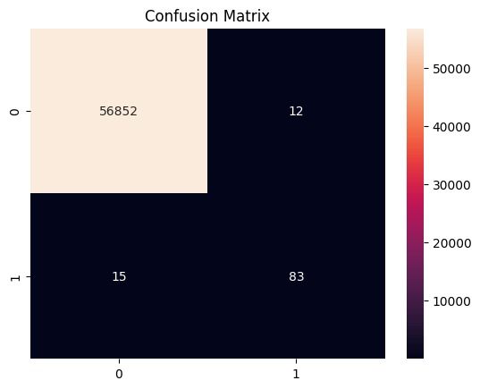
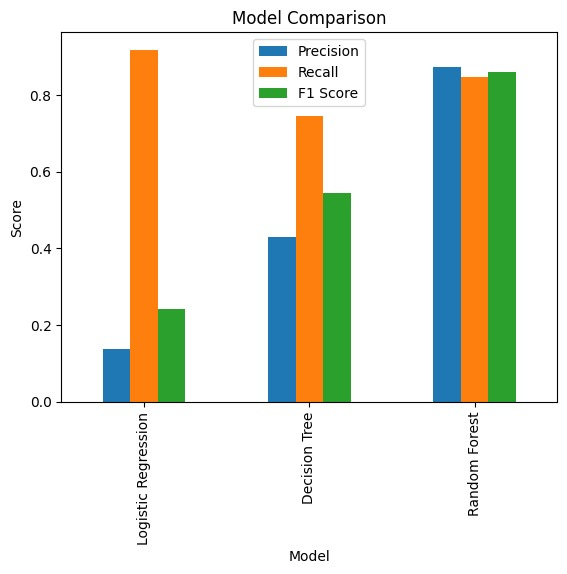

# 💳 Credit Card Fraud Detection System

A Machine Learning-based web application that detects fraudulent credit card transactions using classification algorithms and imbalance handling techniques.

---

## 📌 Overview

This project uses Machine Learning models to identify fraudulent financial transactions from highly imbalanced credit card datasets.

The system includes:
- Data preprocessing
- SMOTE imbalance handling
- Multiple ML model comparison
- Fraud prediction web application using Streamlit

---

## 🚀 Features

- Fraud transaction prediction
- Imbalanced data handling using SMOTE
- Multiple ML models:
  - Logistic Regression
  - Decision Tree
  - Random Forest
- Model comparison and evaluation
- Streamlit web interface
- Visualization and analytics

---

## 🗃️ Dataset

- Credit Card Fraud Detection Dataset
- 284,807 transactions
- Highly imbalanced dataset
- Fraud transactions represent only 0.17% of data

Dataset Source:
https://www.kaggle.com/datasets/mlg-ulb/creditcardfraud

---

## 🧠 Technologies Used

- Python
- Pandas
- NumPy
- Scikit-Learn
- Matplotlib
- Seaborn
- Streamlit
- imbalanced-learn (SMOTE)

---

## 📊 Evaluation Metrics

- Accuracy
- Precision
- Recall
- F1-Score
- Confusion Matrix

---

## 📈 Model Performance

Random Forest achieved the best overall fraud detection performance with strong recall and balanced precision.

---

## 📷 Project Screenshots

### Fraud Distribution

### Confusion Matrix

### Model Comparison

---

## 🚀 Future Improvements

- Real-time fraud detection
- API integration
- Deep learning models
- Cloud deployment

---

## 👩‍💻 Author

Lahari Kodali